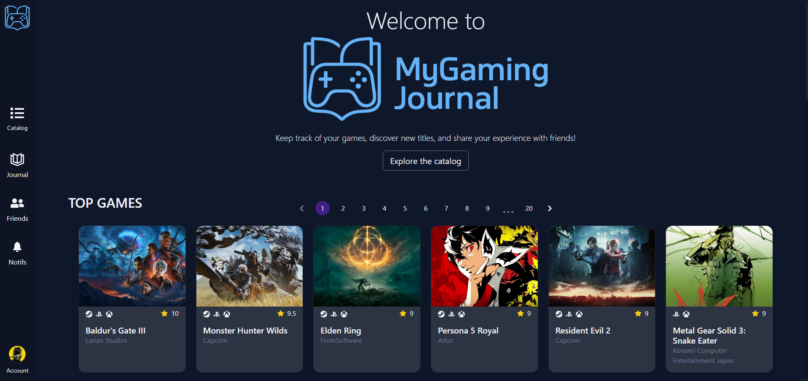
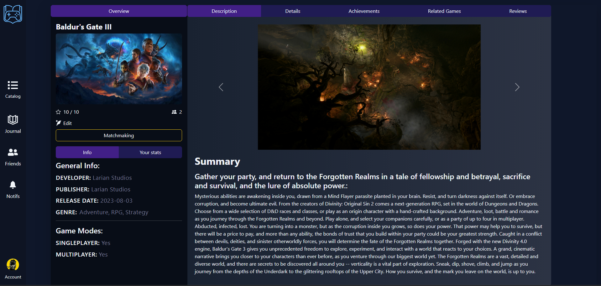
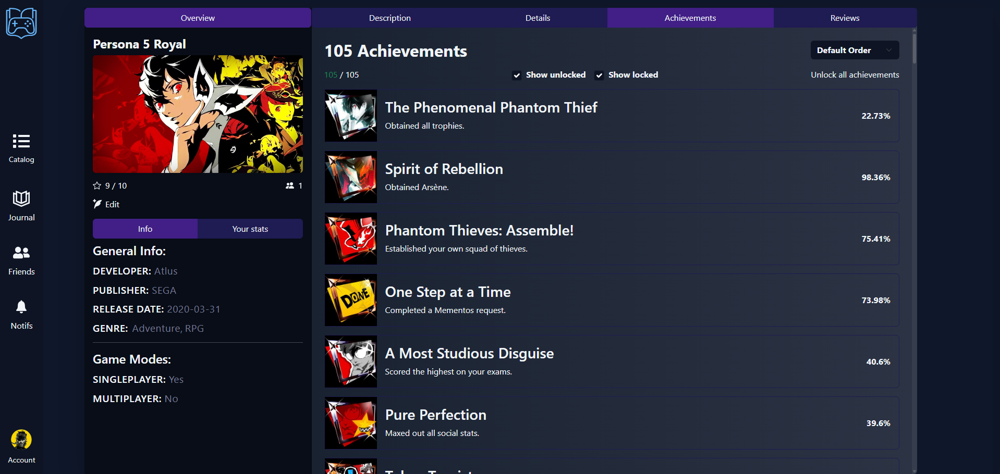
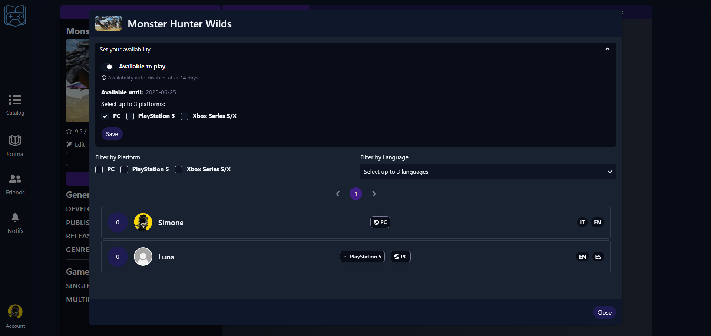
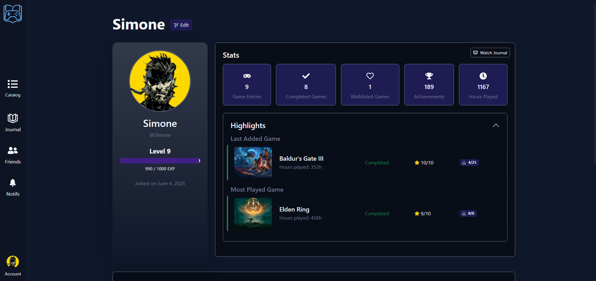

# 🎮 MyGamingJournal

**MyGamingJournal** è una web app che permette agli utenti di tenere traccia dei videogiochi che giocano, vorrebbero giocare o hanno completato.  
Ogni utente può costruire la propria libreria personale, aggiungere voti e recensioni, monitorare statistiche e trofei, e persino trovare altri giocatori con cui condividere partite.

  

## ✨ Funzionalità principali

- 📚 **Libreria personale** con stato, voto, ore giocate, recensione e trofei
- 🎮 **Catalogo di giochi** integrato con l’API di [RAWG](https://rawg.io/apidocs)
- 🧩 **Schede gioco dettagliate** con info, immagini, achievements e giochi correlati
- 🧑‍🤝‍🧑 **Funzione matchmaking** per trovare altri giocatori in base a piattaforma e lingua
- 🏆 **Sistema trofei e statistiche personali**
- 🔐 Registrazione, login e autenticazione sicura tramite JWT

  

## 🧑‍💻 Tecnologie utilizzate

### Frontend
- React
- Redux
- React Router
- Axios
- React-Bootstrap

### Backend
> 🔗 [Link alla repository backend](https://github.com/DGSimone99/mygamingjournal-backend)

- Spring Boot
- Spring Security + JWT
- Spring Data JPA
- Integrazione API RAWG

## Matchmaking

| Matchmaking | Profilo |
|-------------|---------|
|  |  |

Trova facilmente altri giocatori con cui condividere sessioni di gioco grazie a un sistema di matchmaking personalizzato.
Ogni utente può impostare le proprie piattaforme di gioco preferite (es. PC, PlayStation, Xbox) e lingue parlate, e filtrare i profili compatibili.
Un modo rapido per scoprire persone affini con cui giocare ai propri titoli preferiti.

Ogni utente ha un profilo pubblico che funge da diario videoludico personale, dove è possibile vedere i giochi che ha aggiunto, i voti assegnati, le recensioni e le piattaforme utilizzate.
È presente anche un sistema di progressione (leveling) che aumenta automaticamente in base all’attività dell’utente, come l’aggiunta di giochi o l’interazione con la piattaforma.

## 📌 Note

- Progetto realizzato come sviluppo personale per esercizio completo di full stack development
- Interfaccia dark-mode pensata per essere chiara ma coinvolgente
- Ogni funzione è stata sviluppata end-to-end con attenzione alla coerenza tra frontend e backend
- Tutte le informazioni sui giochi sono fornite dall'API di [RAWG](https://rawg.io/apidocs)

---

🧠 *Progetto creato da [DGSimone99](https://github.com/DGSimone99)*  

